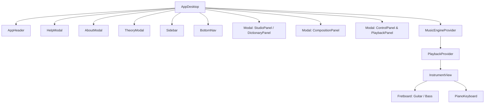
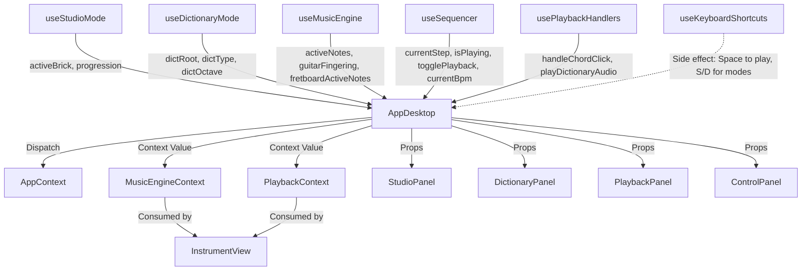

# Architecture — VisualMusic Coach

## Overview

VisualMusic Coach is a React 19 + Vite application with two main modes:
- **Studio**: Interactive music composition with chord progressions, rhythms, and real-time playback
- **Dictionary**: Reference tool for notes, chords, scales with fingering visualization

## Component Tree

## State Management — Three Contexts

### AppContext
- **Purpose**: Global UI state (language, theme, notation, app mode)
- **Provider**: Wraps the entire app at the root level
- **Consumed by**: All components via `useAppContext()`
- **Update pattern**: `dispatch({ type: 'SET_...', payload: ... })`

### MusicEngineContext
- **Purpose**: Music theory state (active notes, fingerings, chord data, scale data)
- **Provider**: Wraps only `InstrumentView` inside AppDesktop
- **Consumed by**: InstrumentView, Fretboard, PianoKeyboard
- **Key fields**:
  1. `appMode`: The current mode of the application ('studio' or 'dictionary')
  2. `activeNotes`: The absolute values of notes currently active for highlighting across instruments
  3. `fretboardActiveNotes`: Notes specifically computed and filtered for rendering on the Fretboard
  4. `guitarFingering`: The calculated fingering objects mapped to strings and frets for the guitar
  5. `bassFingering`: The computed fingering objects mapped to strings and frets for the bass
  6. `showFingering`: Boolean flag indicating whether to display finger numbers or note names on the fretboard
  7. `contextualScaleAbsoluteValues`: Absolute note values for rendering contextual background scales
  8. `clickedChord`: Holds the current chord object when a user clicks a studio chord brick
  9. `selectedRootStringGuitar`: User-selected string index to force the root note position on the guitar
  10. `activeProgression`: The sequence of chords composing the active progression in Studio Mode

### PlaybackContext
- **Purpose**: Sequencer transport state (current step, BPM, play/stop)
- **Provider**: Wraps only `InstrumentView` inside MusicEngineProvider
- **Consumed by**: InstrumentView, SequencerPanel
- **Key fields**: currentStep, isPlaying, currentBpm, togglePlayback, handleBpmChange
- **Why separate**: Changes 16 times per beat — isolating these prevents re-rendering heavy visual components

## Data Flow Diagram

## Custom Hooks

| Hook | Location | Purpose |
|------|----------|---------|
| useStudioMode | src/hooks/ | Manages studio state: bricks, tracks, progressions |
| useDictionaryMode | src/hooks/ | Manages dictionary state: root, type, octave, voicing |
| useMusicEngine | src/hooks/ | Computes active notes, fingerings, inversions |
| useSequencer | src/audio/ | Audio transport: play, stop, BPM, step scheduling |
| usePlaybackHandlers | src/hooks/ | Click-to-play handlers for chords and dictionary |
| useKeyboardShortcuts | src/hooks/ | Space/S/D keyboard shortcuts |
| useMediaQuery | src/hooks/ | Responsive breakpoint detection |

## Audio Pipeline

The application's audio engine acts as the foundational layer, utilizing Tone.js for accurate timing and synthesized sounds. Tone.js is initialized asynchronously via an `initAudio()` process which unlocks the Web Audio Context and configures the audio nodes. Once initialized, standard synths (kick, snare, hi-hat, bass, piano) and acoustic samplers are configured.

The playback scheduling and timing are coordinated by `useSequencer`, which schedules notes 16 times per beat, relying on the Tone Transport. This state updates rapidly and is decoupled via `PlaybackContext` to avoid re-rendering unrelated visual elements. At the same time, one-shot user actions, like clicking a chord in the studio or previewing a dictionary entry, are managed by `usePlaybackHandlers`, which invokes immediate audio playback outside the main sequencer loop.

For the guitar audio, the engine implements a fallback pattern. It attempts to load sampled acoustic guitar sounds via Tone.Sampler (`initGuitarSampler`). If the sampler hasn't finished loading or encounters an issue, the engine smoothly falls back to a basic synthesized sound (`getGuitarSynth`), ensuring the user never experiences complete silence when a guitar note is triggered.

## Key Design Decisions

1. **Contexts split for performance**: PlaybackContext updates at 16th-note resolution; MusicEngineContext updates only on user interaction
2. **Props over Context for panels**: StudioPanel, DictionaryPanel, ControlPanel receive props directly from AppDesktop — they are rendered inside modals and don't need context access
3. **Pure core logic**: `src/core/` contains zero React — all music theory is testable without DOM
4. **Stable dispatch wrappers**: All dispatch functions in AppDesktop are memoized with useCallback to prevent unnecessary child re-renders
