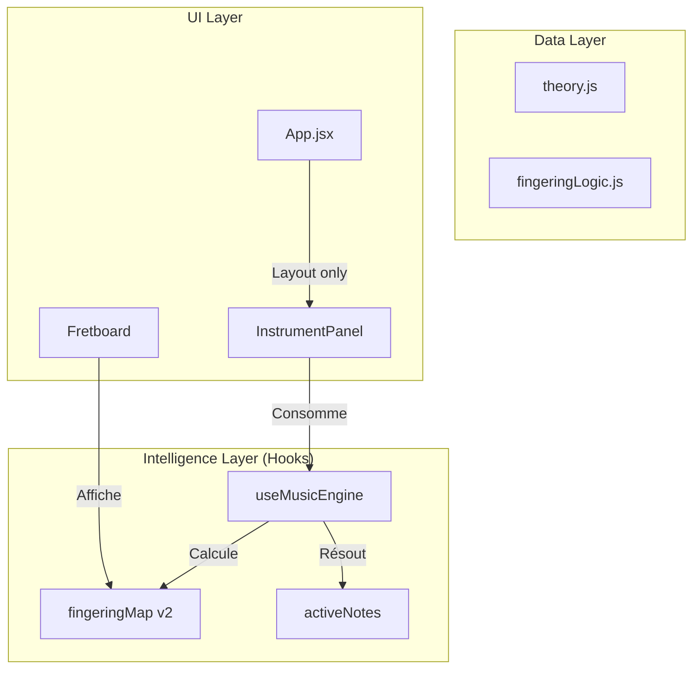

# Matrice de Décision Technique : Refactoring & Architecture de Sélection (F.2)

Ce document traite du déchargement du "God Component" `App.jsx` pour stabiliser la navigation musicale et permettre une évolution sereine vers l'intelligence harmonique.

## 1. Analyse du Problème : Le Monolithe de Gestion
`App.jsx` (574 lignes) gère actuellement 4 responsabilités majeures qui devraient être isolées :
- **Calcul de Doigté** : Logique de sélection des frettes selon l'instrument et l'octave.
- **Dérivation Harmonique** : Transformation des NNS (Nashville Number System) en notes absolues.
- **Synchronisation Audio** : Liaison entre l'état musical et le moteur Tone.js.
- **Mise en Page (Layout)** : Gestion des panneaux, sidebars et thèmes.

Cette intrication provoque des régressions dès qu'on touche au CSS ou qu'on ajoute une option UI.

## 2. Architecture Cible : Le Modèle "Music Engine"
Nous passons d'une logique procédurale à une logique de "Moteur Réactif".

## 3. Matrice d'Aide à la Décision : Choix du Pattern d'État

| Option | Avantages | Inconvénients | Risque de Régression | Recommandation |
| :--- | :--- | :--- | :--- | :--- |
| **A. Prop Drilling continu** | Pas de changement structurel. | `App.jsx` reste obèse. | Élevé (trop de props à passer). | ❌ Non |
| **B. React Context (Current)** | Déjà en place pour `AppContext`. | Peut causer des re-renders inutiles sur tout l'arbre si mal géré. | Faible. | ⚠️ Partiel |
| **C. Hook Centralisé `useMusicEngine`** | **Logique isolée et testable**. Facile à injecter dans n'importe quel composant. | Demande une extraction minutieuse de `App.jsx`. | **Très Faible (Isolation)** | ✅ **Choix Aria** |

## 4. Matrice d'Aide à la Décision : Migration vers TypeScript

| Facteur | JS (Actuel) | TypeScript (Proposé) | Impact |
| :--- | :--- | :--- | :--- |
| **Sécurité des données** | Faible (objets anonymes). | **Maximale (Interfaces strictes)**. | Indispensable pour `fingeringMap`. |
| **Vitesse de Dev** | Rapide au début. | Plus lent au setup, gain massif en debug. | Évite les régressions silencieuses. |
| **Maintenabilité** | Difficile (besoin de tout lire). | Auto-documenté via les types. | Crucial pour la passation de modèle. |

**Décision stratégique** : Commencer par extraire le hook en JS, puis typer les interfaces clés (Fingering, MusicState) même dans un environnement JS via JSDoc ou migration `.ts` des fichiers `core/`.

## 5. Actions de Refinement Prioritaires
1. **Création de `src/hooks/useMusicEngine.js`** : Déplacer les `useMemo` de `guitarFingering` et `bassFingering`.
2. **Standardisation du contrat `MusicState`** : Unifier la sortie pour que `Piano` et `Fretboard` reçoivent le même objet.
3. **Audit de Performance** : Utiliser `React.memo` sur les instruments pour ne re-render que si le `MusicState` change.

---
**Note stratégique** : Ce refactoring est le prérequis obligatoire avant d'implémenter l'Assistant Proactif (Stream C.2), car l'assistant devra "écouter" ce moteur pour donner ses conseils.
